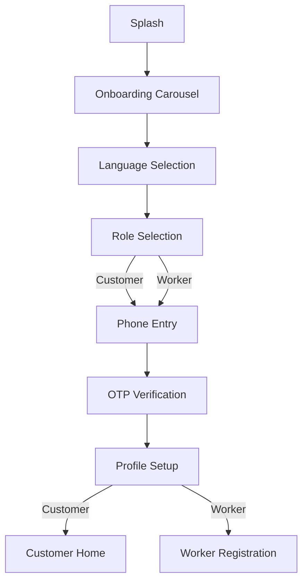
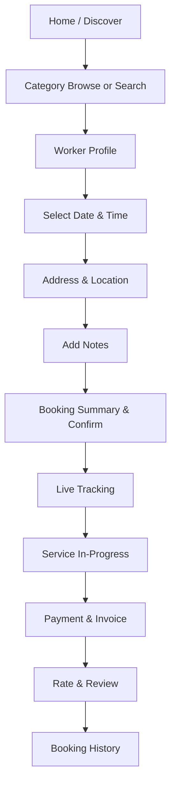
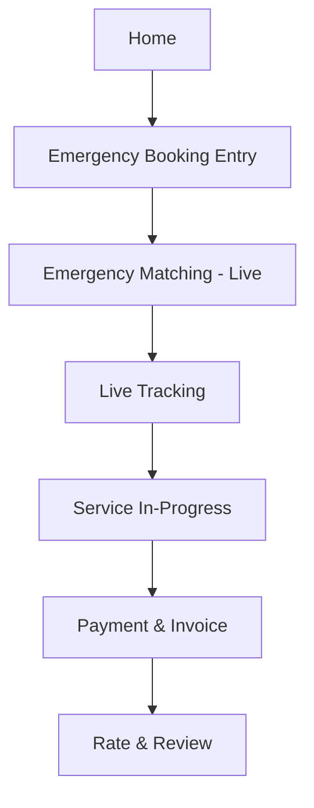
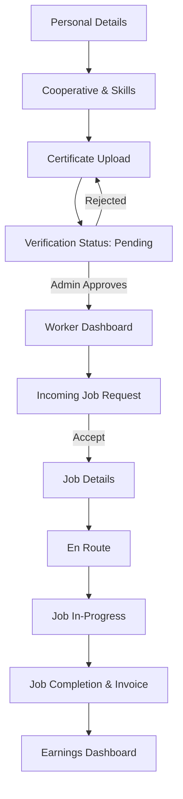

# SahkarSeva — Mobile App Screen Inventory & Color System

**Platform:** React Native (iOS + Android, single codebase) · **Admin:** Next.js web (separate, listed briefly at the end — not part of the mobile screen count)
**Total mobile screens: 49** — 7 shared onboarding/auth, 25 Customer app, 17 Service Provider (Worker) app.

---

## 1. Color System — 60/30/10

The rule: 60% dominant (what the eye rests on — backgrounds, surfaces), 30% secondary (what carries the brand — nav bars, headers, cards, active states), 10% accent (what demands action — CTAs, alerts, live status).

**Why not the obvious choices.** Banks go blue (safety/calm), food apps go red/orange (appetite/urgency) — for a **cooperative trust marketplace**, the emotional job is different: prove that this isn't another extractive private platform, and that a real human, cooperative-verified worker is showing up at your door. That calls for **green** (money staying with the worker, growth, "go"/safety — the same reason cooperative banks and organic/ethical brands lean green) as the trust-carrying color, paired with a **warm terracotta/earth tone** for action (human warmth, urgency, rooted-in-community — deliberately not the cold blue of Uber/Ola or the aggressive red of Zomato/Swiggy, so it doesn't read as "yet another gig app").

| Role | Color | Hex | Usage (~%) | Where it shows up | Why |
|---|---|---|---|---|---|
| **Dominant (60%)** | Warm Off-White | `#FAF8F5` | 60% | Screen backgrounds, cards, sheets | Clean, calm canvas — lets photos of real workers and trust badges stand out instead of competing with a loud UI |
| **Secondary / Brand (30%)** | Cooperative Green | `#1F4D3A` | 30% | Nav bar, headers, primary buttons, verified badges, active tab, progress bars | Trust, "money kept not extracted," growth — the color that should make this feel like *your* app, not a private platform's |
| **Accent (10%)** | Terracotta | `#C05B41` | 8% | Primary CTAs ("Book Now"), Emergency button, notification dots, selected states | Warm urgency without the alarm-red of competitor apps; doubles as the brand's earthy, human identity |
| **Secondary Accent** | Mustard Gold | `#D4A017` | 2% | Star ratings, earnings/wallet highlights, welfare-wallet icon | Value, reward, "what you've earned" — used sparingly, never as a CTA color (would compete with terracotta) |

**Functional / semantic colors** (outside the 60-30-10 brand mix, used only for their specific meaning so they never get confused with brand color):
| Purpose | Hex | Note |
|---|---|---|
| Success / Completed | `#1F4D3A` (reuse brand green) | Job completed, payment successful, verified |
| Error / Destructive | `#D64545` | Form errors, cancel/decline actions — deliberately a truer red than terracotta so the two are never mistaken for each other |
| Warning / Pending | `#D4A017` (reuse gold) | Verification pending, payout processing |
| Text — Primary | `#1E1A16` | Body copy, headings |
| Text — Secondary | `#6E6459` | Captions, metadata, timestamps |
| Divider / Border | `#E7E1D8` | Card borders, list separators |

**Dark mode:** invert the 60: background becomes `#12201A` (near-black green), cards `#1B2E24`, text `#F2EDE6`; keep terracotta and gold accents unchanged — they hold contrast on dark fine.

---

## 2. App Architecture at a Glance

One React Native codebase, two experiences gated by role at login (a worker and a customer never see each other's tab bar):

- **Customer App** — browse, book, track, pay, rate.
- **Worker App** — register, get verified, receive jobs, earn, manage welfare.
- **Shared** — auth/onboarding, chat, notifications, profile shell.

Bottom tab bar (both apps, 4 tabs, icons in brand green when active / muted gray when inactive):
- **Customer:** Home · Bookings · Wallet · Profile
- **Worker:** Home (Jobs) · Earnings · Welfare · Profile

---

## 3. Shared Onboarding & Auth (7 screens)

| # | Screen | Purpose & Key Elements |
|---|---|---|
| 1 | **Splash** | Logo mark (icon in gold circle on green bg), auto-advances |
| 2 | **Onboarding Carousel** (3 slides) | Slide 1: "Workers who own the platform." Slide 2: "Cooperative-verified, not algorithm-verified." Slide 3: "Welfare that follows you." Skip button top-right |
| 3 | **Language Selection** | Grid of language chips (English, Hindi, + regional via Bhashini); remembers choice, editable later in Profile |
| 4 | **Role Selection** | Two large tappable cards: "I need a service" (Customer) / "I provide a service" (Worker) |
| 5 | **Phone Number Entry** | Single phone input, "Send OTP" CTA (terracotta), T&C checkbox with inline links |
| 6 | **OTP Verification** | 6-digit auto-read input, resend timer, "Verify" CTA |
| 7 | **Profile Setup** | Name, photo (camera/gallery), location permission prompt — branches to Customer Home or Worker Registration based on Role Selection |

---

## 4. Customer App (25 screens)

### Discover & Browse
| # | Screen | Purpose & Key Elements |
|---|---|---|
| 8 | **Home / Discover** | Search bar, category grid (Electrician, Plumber, Carpenter, Painter, Domestic Help, Caregiver, Driver, Gardener, Cleaner, Technician), terracotta "Emergency Service" banner, recently booked strip |
| 9 | **Search Results** | List/grid from free-text search, empty-state illustration if no match |
| 10 | **Category Browse** | Workers filtered by category, sortable list, Filters button opens bottom sheet (not a separate screen — distance, price, rating, availability-today toggles) |
| 11 | **Worker Profile** | Photo, name, "Verified by [Cooperative Name]" badge (green), skills, rating breakdown, price list, availability calendar, reviews, sticky "Book Now" CTA |

### Booking Flow
| # | Screen | Purpose & Key Elements |
|---|---|---|
| 12 | **Select Date & Time** | Calendar + time-slot picker pulled from worker's availability |
| 13 | **Address & Location** | Map (MapLibre) with draggable pin, geolocation auto-fill, saved-address chips |
| 14 | **Add Notes** | Free-text + optional photo attach ("what needs fixing") |
| 15 | **Booking Summary & Confirm** | Full recap, price estimate, "Confirm Booking" CTA |
| 16 | **Emergency Booking Entry** | Distinct terracotta full-bleed screen — category grid only, no calendar, "Request Now" |
| 17 | **Emergency Matching (Live)** | Animated radar/pulse around customer's pin while nearest verified worker is found, shows ETA once matched |

### Live Job & Communication
| # | Screen | Purpose & Key Elements |
|---|---|---|
| 18 | **Live Tracking** | Map with worker's live location, status stepper (Requested → Accepted → En Route → In Progress → Completed), worker mini-card |
| 19 | **Chat & Call** | In-app text thread + one-tap voice call button, quick-reply chips ("On my way", "Running 10 min late") |
| 20 | **Service In-Progress** | Job timer, "Contact Worker," "Report an Issue" link |
| 21 | **Cancel Booking** | Reason picker, cancellation-policy note, confirm/back |

### Payment & Post-Service
| # | Screen | Purpose & Key Elements |
|---|---|---|
| 22 | **Payment Method Selection** | UPI / Card / Wallet radio list, "Add New Method" link |
| 23 | **Payment Success + Invoice** | Success animation, auto-generated digital invoice (service, worker, duration, cooperative name, amount) with Download/Share |
| 24 | **Rate & Review** | 5-star tap, optional comment, tag chips ("On time," "Professional," "Great work") |

### Account & History
| # | Screen | Purpose & Key Elements |
|---|---|---|
| 25 | **Booking History** | Tabs: Upcoming / Past / Cancelled |
| 26 | **Booking Detail** | Full detail of a single past/upcoming booking, re-book shortcut |
| 27 | **Favorites** | Saved/favorite workers grid |
| 28 | **Wallet & Payment Methods** | Saved UPI IDs / cards, transaction history |
| 29 | **Customer Profile** | Edit name/photo/phone, saved addresses, language, logout |
| 30 | **Notifications** | Booking updates, offers, system alerts — unread dot in terracotta |
| 31 | **Help & Support / FAQ** | Searchable FAQ, "Raise an Issue" form (also reachable from Booking Detail), contact options |
| 32 | **Refer & Earn** | Referral code, share sheet, reward tracker |

---

## 5. Service Provider (Worker) App (17 screens)

### Registration & Verification
| # | Screen | Purpose & Key Elements |
|---|---|---|
| 33 | **Registration — Personal Details** | Name, phone (prefilled), address, ID number field |
| 34 | **Registration — Cooperative & Skills** | Cooperative Society dropdown/search, multi-select skill categories, years of experience |
| 35 | **Registration — Certificate Upload** | Camera/file upload for ID + skill certificates, progress checklist |
| 36 | **Verification Status** | Pending (gold) / Verified (green badge) / Rejected (red, with reason + re-submit) |

### Dashboard & Jobs
| # | Screen | Purpose & Key Elements |
|---|---|---|
| 37 | **Worker Dashboard / Home** | Online/Offline toggle (prominent, top), today's jobs list, earnings-today snapshot, rating badge |
| 38 | **Availability & Schedule** | Weekly calendar editor, block-off-time option |
| 39 | **Incoming Job Request** | Customer's service type, address (approx until accepted), price, Accept/Decline — countdown ring for emergency requests |
| 40 | **Job Details (Pre-Start)** | Full customer address, contact, notes/photo from booking, "Start Navigation" CTA |
| 41 | **En Route / Navigate** | Map + turn-by-turn (MapLibre), "Arrived" button |
| 42 | **Job In-Progress** | "Mark Started" → "Mark Completed" flow, optional before/after photo capture |
| 43 | **Job Completion & Invoice** | Auto-generated invoice preview, customer signature/OTP confirmation, "Submit" |

### Earnings & Welfare
| # | Screen | Purpose & Key Elements |
|---|---|---|
| 44 | **Earnings Dashboard** | Daily/weekly/monthly chart, jobs completed count, ~95%-retained breakdown vs. cooperative fee |
| 45 | **Payout & Bank Linking** | Bank account/UPI linking form, payout schedule |
| 46 | **Welfare & Insurance Home** | Enrollment status card (gold if pending, green if active), linked e-Shram UAN, scheme name |
| 47 | **Claim Submission & Tracker** | Claim reason form → status stepper (Submitted → Under Review → Approved), single screen with state-based views |
| 48 | **Reviews Received** | Average rating, list of customer reviews |

### Account
| # | Screen | Purpose & Key Elements |
|---|---|---|
| 49 | **Worker Profile & Settings** | Edit details, notification preferences, language, logout, Worker Notifications feed lives here as a sub-tab, Help & Support link reuses the customer FAQ shell with worker-specific topics |

---

## 6. High-Level User Flows

### 6.1 Onboarding → Role Split

### 6.2 Customer — Standard Booking

### 6.3 Customer — Emergency Booking

### 6.4 Worker — Registration to First Job

---

## 7. Admin Dashboard (Next.js web — separate scope, not in the 49-screen mobile count)

For completeness, since it shares the same backend and color system: Login → Dashboard Overview (stat cards + charts) → Worker Verification Queue → Worker Directory → Booking Oversight → Welfare & Insurance Management → Service & Pricing Management → Reports. Same 60/30/10 palette, just laid out as a data-dense web dashboard rather than touch-first mobile screens.

---

## 8. Build Notes

- **Not every "screen" above needs a route in your navigator on day one.** Filters, Cancel Booking, and the Refer & Earn screen are good candidates for bottom sheets/modals rather than full push screens — faster to build, feels lighter on mobile.
- **Reuse the same components across both apps** where the shape matches: the Booking Detail card, the Rating stars, the map/tracking view, and the invoice layout are near-identical between Customer and Worker — build them once, theme by role if needed.
- **Priority build order**, if you want a demoable slice fast: Shared Auth (7) → Customer Home through Payment & Invoice (8–23) → Worker Registration through Job Completion (33–43) → everything else (History, Wallet, Welfare, Favorites, Help) layers on top once the core loop works end-to-end.
